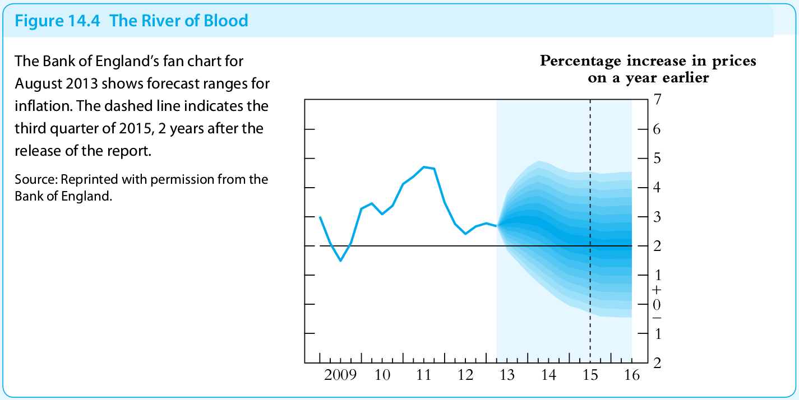

## Лекцүүд

|     	| Сэдэв                                                                                       	| Бүлэг        	| Нэмж унших материал                                                                                                      	| Өгөгдлийн файл                         	|
|-----	|---------------------------------------------------------------------------------------------	|--------------	|--------------------------------------------------------------------------------------------------------------------------	|----------------------------------------	|
| 1.  	| [Хичээлийн судлах зүйлс, Шугаман регрессийн мэдлэгээ бататгах ](pages/Lectures/slide.html ) 	| Chapter 1, 2 	| [Linear Regression with One Regressor ](https://www.econometrics-with-r.org/3-1-estimation-of-the-population-mean.html ) 	|                                        	|
| 2.  	| Амжилттай таамаглал хийх үндсүүд                                                            	| Chapter 3    	|                                                                                                                          	|                                        	|
| 3.  	| [График анализ](pages/Lectures/slide2.html)                                                 	| Chapter 4    	| 0                                                                                                                        	|                                        	|
| 4.  	| [Тренд загварчлах, таамаглах](pages/Lectures/slide3.html)                                   	| Chapter 5    	| [R Notebook](pages/Lectures/Notebook1.html)                                                                              	| [data 5](pages/Lectures/ch5data.Rdata) 	|
| 5.  	| [Улиралын нөлөөг загварчлах, таамаглах](pages/Lectures/slide4.html)                         	| Chapter 6    	| [R Notebook](pages/Lectures/Notebook2.html)                                                                              	| [data 6](pages/Lectures/ch6data.Rdata) 	|
| 6.  	| [Мөчлөгийг тодорхойлох](pages/Lectures/slide5.html)                                         	| Chapter 7    	|                                                                                                                          	|                                        	|
|     	|                                                                                             	|              	|                                                                                                                          	|                                        	|
|     	|                                                                                             	|              	|                                                                                                                          	|                                        	|
|     	|                                                                                             	|              	|                                                                                                                          	|                                        	|
|     	|                                                                                             	|              	|                                                                                                                          	|                                        	|

## Сурах бичиг

[Diebold Francis *"Elements of Forecasting"*](https://www.sas.upenn.edu/~fdiebold/Textbooks.html)

[James H. Stock, Mark W. Watson *"Introduction to Econometrics"*](https://scholar.harvard.edu/stock/pages/introduction-econometrics)

## R Sources

[Christoph Hanck, Martin Arnold, Alexander Gerber and Martin Schmelzer *"Introduction to Econometrics with R"*](https://www.econometrics-with-r.org/index.html)

[Florian Heiss *"Using R for Introductory Econometrics"*](http://www.urfie.net/)