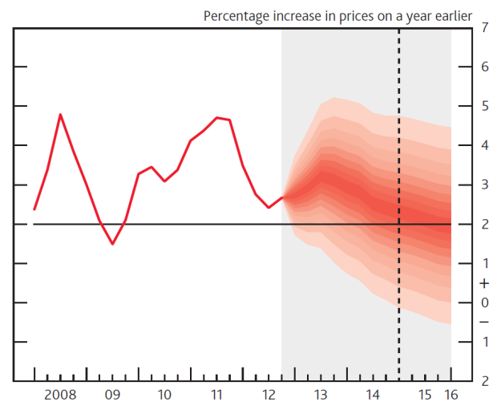

```{r setup, include=FALSE}
options(htmltools.dir.version = FALSE)
```

---

# Таамаглал (forecast)

<div class="columns-2">
  .center[]

  - Bullet 1
  - Bullet 2
  - Bullet 3
</div>

---
# Таамаглал (forecast)

`Таамаглал`: Ирээдүйн талаархи дүгнэлт.

 - Юуг таамаглаж болох вэ?
 - Эдийн засагчид таамаглалыг хэрхэн хийдэг бэ?
 - Таамаглалын зөв байдлыг  хэрхэн хэмжих вэ?
 - Таамаглах аргуудын шинж чанар
 - Таамаглалын аргачлалын сул талууд, шийдэл

Нэг болон олон хэмжээст хугацааны цувааны хандлага, улирлын нөлөө, мөчлөг, санамсаргүй хүчин зүйлийн нөлөө гэсэн дөрвөн бүрэлдэхүүн хэсгийг ялгаж, хэрхэн загварчлах, таамаглал хийх.

---

# Таамаглалын аргачлал

`Таамаглалын аргачлал`: Статистикийн загварт үндэслэн ирээдүйн боломжит утгуудыг олох

 - Аргачлал
  
  - стационарь хугацаан цувааны загварчлал
  - Тренд бүхий хугацаан цувааны загварчлал
    - Улирлын нөлөө
    - Мөчлөг
    - стохастик тренд
 - Үнэлгээ
 
   - Таамаглалын алдаа
   - Модель сонголт
   
---

# Сурах бичиг, ашиглах материал

Сурах бичиг 

 - Diebold Francis X "Elements of Forecasting" 2008
 - Enders Walter "Applied Econometric Time Series" 2015
 - James H. Stock, Mark W. Watson "Introduction to Econometrics"
 
Software
 
 - R
 - EViews
 - Stata
 
---
class: inverse, center, middle

# Predictive Regression: Review

<html><div style='float:left'></div><hr color='#EB811B' size=1px width=720px></html> 

---
 
## Simple Regression

$$y_t=x_t'\beta+\varepsilon_t$$
 - $i=1,...,T$
 - $\varepsilon_t\sim iid(0,\sigma^2)$
 
 $$\min\sum_{t=1}^T(y_t-x_t'\beta)^2$$
  

   
---

# Anscombe


---

# Two dashes

The easiest way to build incremental slides is...
--
 to use two dashes `--` to separate content on a slide.

--

You can divide a slide in _any way you want_.

--

- One bullet

- Another bullet

--

- And one more

--

.center[


Don't saw your slides too hard.
]