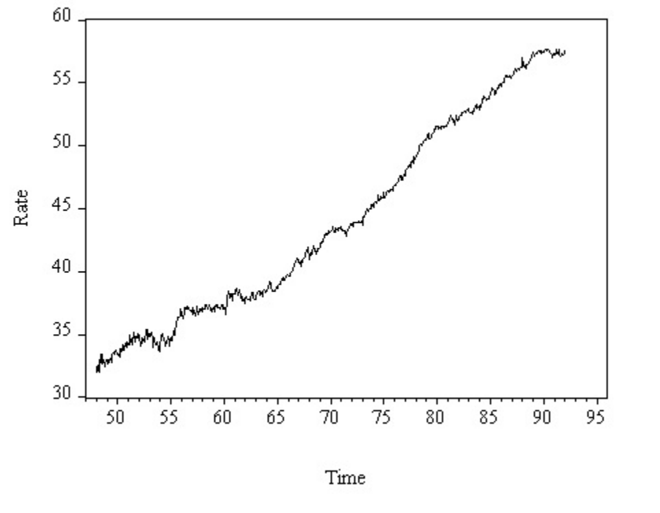
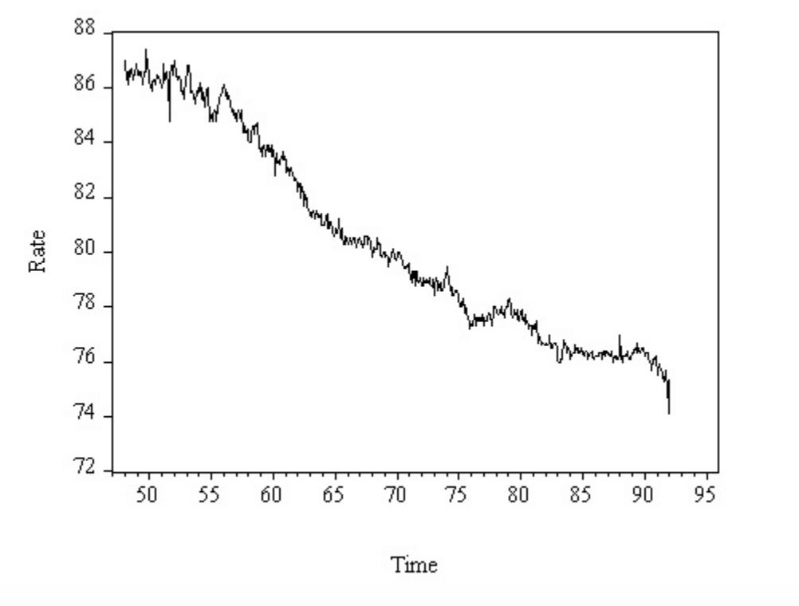
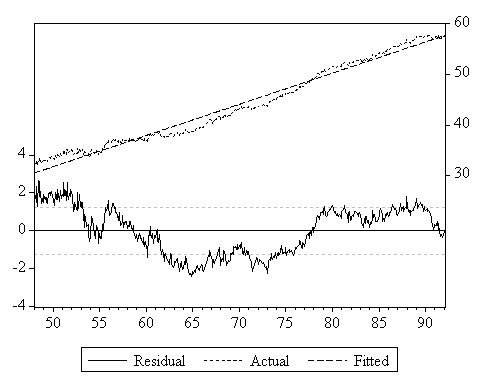
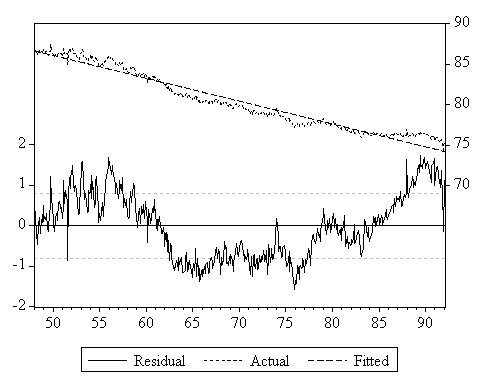
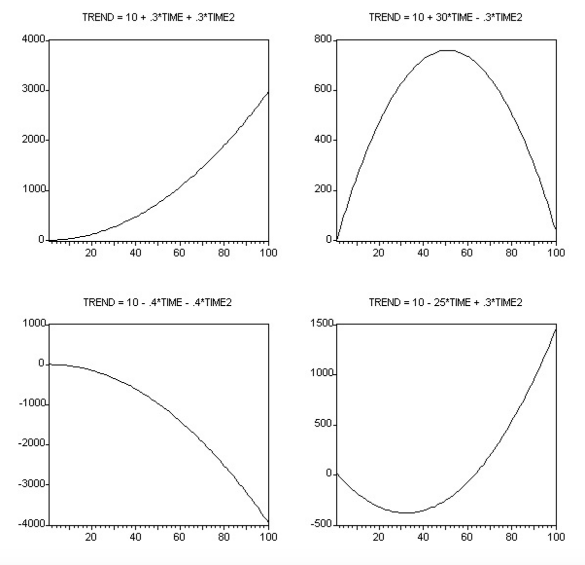
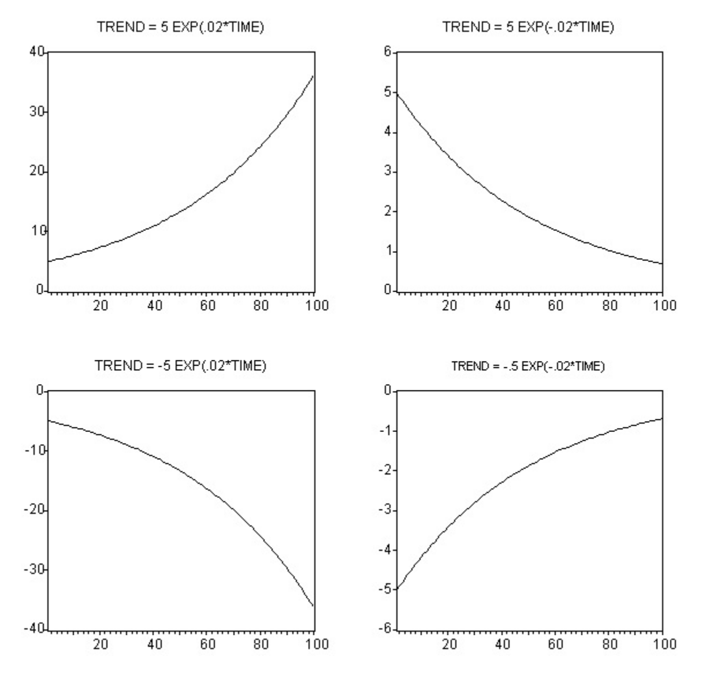
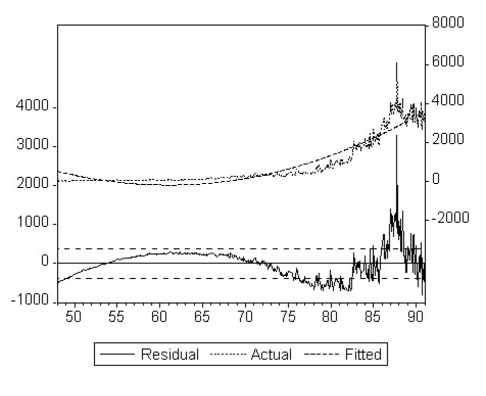
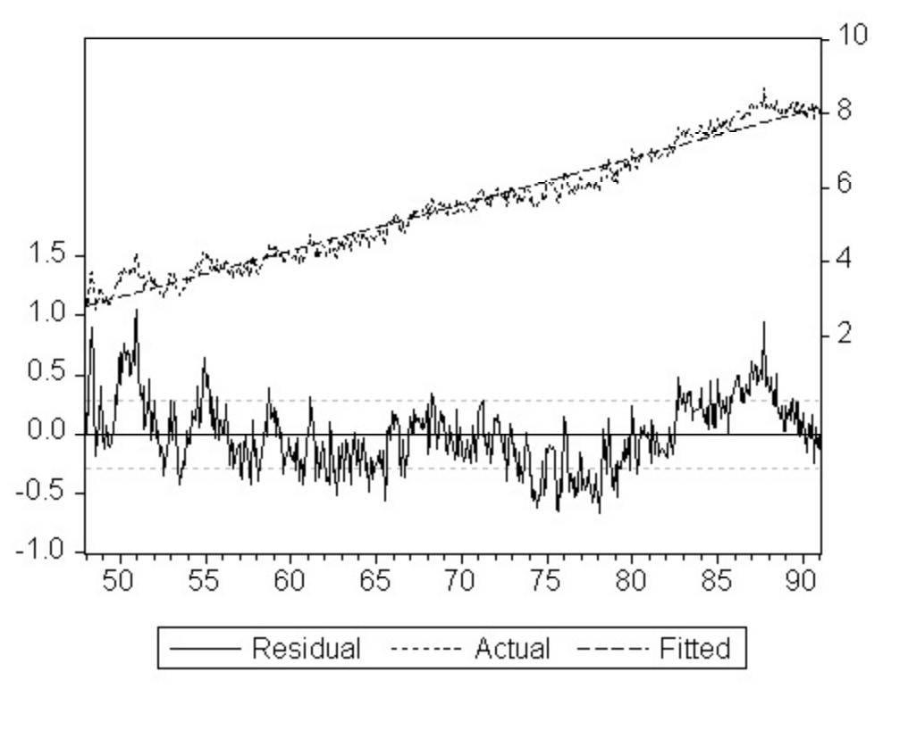
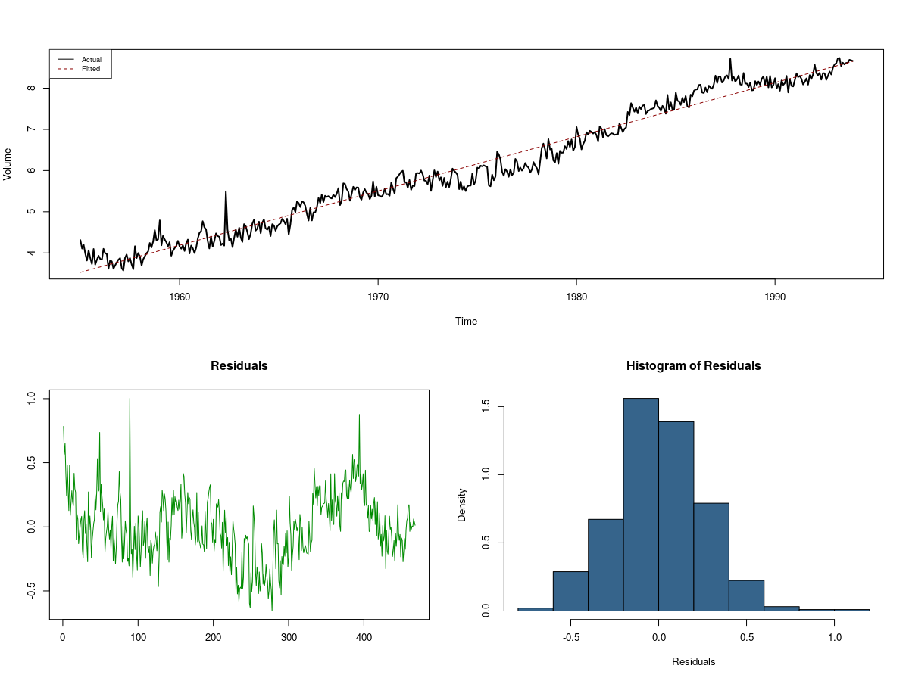

```{r setup, include=FALSE}
options(htmltools.dir.version = FALSE)
```

---

# Улиралын нөлөөг загварчлах

 - **Тренд**: хугацаан цуваан дахь удаан, урт хугацааны өөрчлөлт
 
 - **Детерминистик тренд**: Урьдчилан мэдэгдэх тренд (`time trend`)

--

.pull-left[

 
 - *Өсөх Тренд: Эмэгтэйчүүдийн хөдөлмөрийн зах зээлийн оролцоо*

]

--
.pull-right[


 - *Буурах Тренд: Эрэгтэйчүүдийн хөдөлмөрийн зах зээлийн оролцоо*

]
 
---
# Трендийг загварчлах

 - **Хугацаан цуваа**: $\{y_1, ...,y_T\}$

 - **Хугацааны индекс**: $(1, ...,T)$

Хугацаан цувааны индекс нь трендийг тайлбарлах гол хувьсагч: $\text{TIME}_t=t$

$$\text{TIME}=\begin{bmatrix}1 \\ 2 \\ \vdots \\ T\end{bmatrix}$$

## Тренд

 - Трендийг зөвхөн `TIME`-с хамааруулан загварчилдаг. 
 - **Шугаман трендийн загвар**
 
 $$\text{Trend}_t=\beta_0+\beta_1\text{TIME}_t$$
---
# Шугаман трендийн загвар
 
 $$\text{Trend}_t=\beta_0+\beta_1\text{TIME}_t$$

```{r, echo=FALSE, fig.fullwidth=TRUE, fig.align='center', fig.width = 9,fig.height=5.59,fig.cap="Өсөх, буурах шугаман тренд"}
plot(x = NULL, y = NULL,
     xlim = c(0, 100),
     ylim = c(-60, 40), xlab = "Time", ylab="Trend")
abline(a = 10,b = -0.25)
abline(a = -50, b = 0.8,lty="dashed")
text(20,15,"Trend = 10 - 0.25*Time")
text(32,-42,"Trend =- 50 + .8*Time")
```

---
# Шугаман трендийн загвар

.pull-left[

 
 - *Өсөх Тренд: Эмэгтэйчүүдийн хөдөлмөрийн зах зээлийн оролцоо*

]


.pull-right[


 - *Буурах Тренд: Эрэгтэйчүүдийн хөдөлмөрийн зах зээлийн оролцоо*

]

---

# Шугаман бус трендийн загвар

.center[
]
 Зарим тохиолдолд хугацаан цуваа илт шугаман бус трендтэй байдаг.
 
---
# Шугаман бус тренд загвар

 - **Квадрат Тренд** $$\text{Trend}_t=\beta_0+\beta_1\text{TIME}_t+\beta_2\text{TIME}_t^2$$
 - **Экспоненциал Тренд** $$\text{Trend}_t=\beta_0\exp(\beta_1\text{TIME}_t)$$
   
   - log linear trend: $$\log(\text{Trend}_t)=\log(\beta_0) + \beta_1\text{TIME}_t$$

---
# Шугаман бус тренд загварын хэлбэрүүд
.pull-left[

 - *<font color="red">Квадрат трендийн хэлбэрүүд</font>*
 ]
.pull-right[

 - *<font color="red">Экспоненциал трендийн хэлбэрүүд</font>*
 ]

---
# Шугаман бус тренд загварын таарамж

.pull-left[

 - *<font color="red">Экспоненциал трендийн таарамж</font>*
]


.pull-right[

  - *<font color="red">Лог трендийн таарамж</font>*

]

---

# Тренд Загварын Үнэлгээ


<font color="blue">Шугаман Тренд</font> : (R code `lm(y~time)`)
$$(\hat\beta_0, \hat\beta_1) = \underset{\beta_0, \beta_1, }{\text{argmin}}\sum_{t=1}^T(y_t-\beta_0-\beta_1\text{TIME}_t)^2$$
<font color="blue">Квадрат Тренд</font> (R code `lm(y~time + time2)`)
$$(\hat\beta_0, \hat\beta_1, \hat\beta_2) = \underset{\beta_0, \beta_1, \beta_2}{\text{argmin}}\sum_{t=1}^T(y_t-\beta_0-\beta_1\text{TIME}_t-\beta_2\text{TIME}_t^2)^2$$
<font color="blue">Экспоненциал Тренд</font> (Rcode `nls(y~beta0*exp(beta1*time))`
$$(\hat\beta_0, \hat\beta_1)=\underset{\beta_0, \beta_1}{\text{argmin}}\sum_{t=1}^T(y_t-\beta_0\exp(\beta_1\text{TIME}_t))^2$$
<font color="blue">log-linear</font>(Rcode `lm(log(y) ~ time)`
$$(\hat\beta_0, \hat\beta_1) = \underset{\beta_0, \beta_1, }{\text{argmin}}\sum_{t=1}^T(\log(y_t)-log(\beta_0)-\beta_1\text{TIME}_t)^2$$
---

# Үнэлгээ

.center[
]

---
# Үнэлгээ

.center[
]

---
# Тренд загварыг таамаглах
Шугаман тренд загвар

$$\color{red}{y_t = \beta_0 + \beta_1 \text{TIME}_t + \varepsilon_t,\quad \varepsilon_t\sim \text{i.i.d}N(0, \sigma^2)}$$
Ирээдүйн $T+h$ цэгт хугацаан цувааны утга
$$y_{T+h}= \beta_0 + \beta_1 \text{TIME}_{T+h} + \varepsilon_{T+h}$$
Мэдэгдэж буй хувьсагч $\text{TIME}_{T+h}$
$$y_{T+h,T} = \beta_0 + \beta_1 \text{TIME}_{T+h}$$
**h-ahead forecasts**

--


|                                                    <font color="red">Цэгэн таамаглал</font> 	|                                 <font color="blue">Интервал таамаглал</font> 	|                               Нягтын таамаглал 	|
|------------------------------------------------------------------:	|--------------------------------------------------:	|-----------------------------------------------:	|
| $$\color{red}{\hat{y}_{T+h,T} =\hat\beta_0 + \hat\beta_1 \text{TIME}_ {T+h}}$$ 	| $$\color{blue}{\hat{y}_{T+h,T}\pm 1.96\hat\sigma_\varepsilon}$$ 	| $$N(\hat{y}_{T+h,T}, \hat\sigma_\varepsilon)$$ 	|

---
# Модел сонголтын шинжүүр

$$MSE=\frac{\sum_{t=1}^Te_t^2}{T}$$
$$R^2=1-\frac{\sum_{t=1}^Te_t^2}{\sum_{t=1}^T(y_t-\bar{y})^2}$$
Сул тал: хувьсагчдын тоог нэмэх тусам MSE буурна.

$$\bar{R}^2=1-\frac{\sum_{t=1}^Te_t^2/(T-k)}{\sum_{t=1}^T(y_t-\bar{y})^2/(T-1)}=1-\frac{s^2}{\sum_{t=1}^T(y_t-\bar{y})^2/(T-1)}$$

---
# Модел сонголтын шинжүүр

## Akaike Information Criterion

$$AIC=e^{\frac{2k}{T}}\frac{\sum_{t=1}^Te_t^2}{T}$$

## Schwartz Information Criterion
$$SIC=T^{\frac{k}{T}}\frac{\sum_{t=1}^Te_t^2}{T}$$

---
# Хэрэглээ

## Жижиглэн худалдааны борлуулалтыг таамаглах
```{r, echo=FALSE, message=FALSE,fig.fullwidth=TRUE, fig.align='center', fig.width = 11,fig.height=7}
library(dplyr)
load("ch5data.Rdata")
RTRR <- ch5data %>% select(date, rtrr) %>% 
  filter(!rtrr %in% NA, date > as.Date("1954-12-01")) %>% 
  mutate(time        = row_number(), 
         time2       = time^2)
train <- RTRR %>% filter(date < as.Date("1994-01-01"))
test <- RTRR %>% filter(date >= as.Date("1994-01-01"))
reg1 <- lm(rtrr~time, data = train)
reg2 <- lm(rtrr~time + time2, data = train)
reg3 <- nls(rtrr~beta0*exp(beta1*time), data = train,
            start =c(beta0=1000, beta1=0))
plot(rtrr ~ date, data =  train, 
     type = "l", 
     lwd = 2, 
     xlab = "Time", 
     ylab="Sales",
     main = "Monthly Retail Sales:1955.01-1993.12")
lines(train$date, fitted(reg1), col="blue", lty=2)
lines(train$date, fitted(reg2), col="red", lty=3, lwd=2)
lines(train$date, fitted(reg3), col="green4", lty=4)
legend("topleft", c("Linear", "Quadratic", "Exponential"), 
       lty = c(2, 3, 4), 
       col = c("blue", "red", "green"),
       cex = .7)
```

---

<table style="text-align:center"><caption><strong>Retail Sales Models</strong></caption>
<tr><td colspan="4" style="border-bottom: 1px solid black"></td></tr><tr><td style="text-align:left"></td><td colspan="3"><em>Dependent variable:</em></td></tr>
<tr><td></td><td colspan="3" style="border-bottom: 1px solid black"></td></tr>
<tr><td style="text-align:left"></td><td colspan="3">Monthly Retail Sales</td></tr>
<tr><td style="text-align:left"></td><td>Linear</td><td>Quadratic</td><td>Exponential</td></tr>
<tr><td colspan="4" style="border-bottom: 1px solid black"></td></tr><tr><td style="text-align:left">time</td><td>349.773</td><td>-98.311</td><td>0.005944</td></tr>
<tr><td style="text-align:left"></td><td></td><td></td><td></td></tr>
<tr><td style="text-align:left">time2</td><td></td><td>0.955</td><td></td></tr>
<tr><td style="text-align:left"></td><td></td><td></td><td></td></tr>
<tr><td style="text-align:left">Constant</td><td>-16,391.250</td><td>18,708.700</td><td>11967.80</td></tr>
<tr><td style="text-align:left"></td><td></td><td></td><td></td></tr>
<tr><td colspan="4" style="border-bottom: 1px solid black"></td></tr><tr><td style="text-align:left">Observations</td><td>468</td><td>468</td><td>468</td></tr>
<tr><td style="text-align:left">R<sup>2</sup></td><td>0.899</td><td>0.997</td><td>0.988</td></tr>
<tr><td style="text-align:left">AIC</td><td>10,385.060</td><td>8,738.186</td><td>9335.215</td></tr>
<tr><td style="text-align:left">BIC</td><td>10397.5</td><td>8754.78</td><td>9347.66</td></tr>
<tr><td colspan="4" style="border-bottom: 1px solid black"></td></tr></table>
---

|     	| Linear 	| <font color="red">Quadratic</font> 	| Exponential 	|
|:---:	|:------:	|:---------:	|:-----------:	|
| AIC 	|  19.35 	|   <font color="red">15.83</font>   	|    17.15    	|
| SIC 	|  19.37 	|   <font color="red">15.86</font>   	|    17.17    	|

Сонгогдсон загвар

$$y_t=18708.70 - 98.31130*t+0.955404*t^2,\quad \hat\sigma_\varepsilon=2725.276$$

1-step ahead forecast

$$\hat y_{T+1, T}=18708.70 - 98.31130*469+0.955404*469^2=182752.3$$
95% interval : $$[177404.5, 188098.3]$$ 
---
# Квадрат Трендийн таамаглал

```{r, echo=FALSE, message=FALSE,fig.fullwidth=TRUE, fig.align='center', fig.width = 11,fig.height=7}
point_forecasts <- predict(reg2, test)
plot_data <- RTRR %>% filter(date > as.Date("1990-01-01"))
plot(plot_data$date, plot_data$rtrr,  
     type = "l", 
     lwd = 2, 
     xlab = "Time", 
     ylab="History, Forecasts, Realization",
     main = "Monthly Retail Sales")
abline(v = as.Date("1994-01-01"), lty=2,col = "gray")
polygon(c(as.Date("1994-01-01") ,  as.Date("1994-01-01"), as.Date("1995-01-01"), as.Date("1995-01-01")), 
        c(min(plot_data$rtrr), max(plot_data$rtrr),  max(plot_data$rtrr), min(plot_data$rtrr)), col = "grey85", border = NA)
lines(plot_data$date, plot_data$rtrr, lwd = 2) 
lower <- point_forecasts - 1.96*2728
upper <- point_forecasts + 1.96*2728
lines(point_forecasts, type = "l", lwd=2, col="red")
lines(test$date , point_forecasts, type = "l", col = "red", lwd=2, lty=2)
lines(test$date , lower, type = "l", col = "red", lty = 2)
lines(test$date , upper, type = "l", col = "red", lty = 2)
```

---

# Шугаман трендийн таамаглал

```{r echo=FALSE, message=FALSE,fig.fullwidth=TRUE, fig.align='center', fig.width = 11,fig.height=7}
point_forecasts <- predict(reg1, test)
plot_data <- RTRR %>% filter(date > as.Date("1990-01-01"))
plot(plot_data$date, plot_data$rtrr,  
     type = "l", 
     lwd = 2, 
     xlab = "Time", 
     ylab="History, Forecasts, Realization",
     main = "Monthly Retail Sales", ylim=c(110000, 200000))
abline(v = as.Date("1994-01-01"), lty=2,col = "gray")
polygon(c(as.Date("1994-01-01") ,  as.Date("1994-01-01"), as.Date("1995-01-01"), as.Date("1995-01-01")), 
        c(110000, 200000,  200000, 11000), col = "grey85", border = NA)
lines(plot_data$date, plot_data$rtrr, lwd = 2) 
lower <- point_forecasts - 1.96*15870
upper <- point_forecasts + 1.96*15870
lines(point_forecasts, type = "l", lwd=2, col="red")
lines(test$date , point_forecasts, type = "l", col = "red", lwd=2, lty=2)
lines(test$date , lower, type = "l", col = "red", lty = 2)
lines(test$date , upper, type = "l", col = "red", lty = 2)
```


Экспоненциал Тренд $$(\hat\beta_0, \hat\beta_1)=\underset{\beta_0, \beta_1, \beta_2}{\text{argmin}}\sum_{t=1}^T(y_t-\beta_0\exp(\beta_1\text{TIME}_t))^2$$c