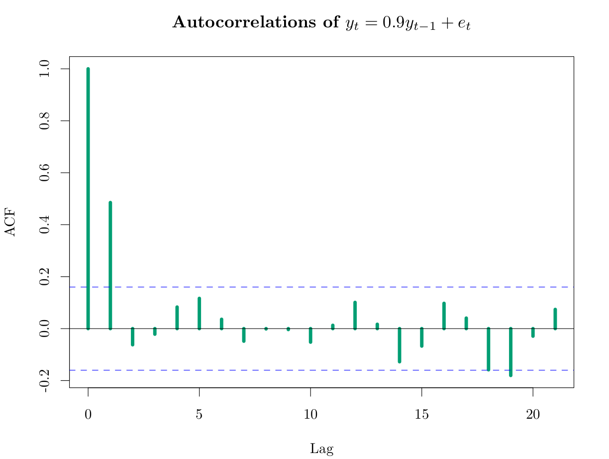

```{R, setup, include = F}
options(htmltools.dir.version = FALSE)
library(pacman)
p_load(
  broom, here, tidyverse,
  latex2exp, ggplot2, ggthemes, viridis, extrafont, gridExtra,
  kableExtra,
  data.table,
  dplyr,
  lubridate,
  magrittr, knitr, parallel
)
# Define pink color
red_pink <- "#e64173"
turquoise <- "#20B2AA"
grey_light <- "grey70"
grey_mid <- "grey50"
grey_dark <- "grey20"
# Dark slate grey: #314f4f
# Knitr options
opts_chunk$set(
  comment = "#>",
  fig.align = "center",
  fig.height = 7,
  fig.width = 10.5,
  warning = F,
  message = F
)
opts_chunk$set(dev = "svg")
options(device = function(file, width, height) {
  svg(tempfile(), width = width, height = height)
})
# A blank theme for ggplot
theme_empty <- theme_bw() + theme(
  line = element_blank(),
  rect = element_blank(),
  strip.text = element_blank(),
  axis.text = element_blank(),
  plot.title = element_blank(),
  axis.title = element_blank(),
  plot.margin = structure(c(0, 0, -0.5, -1), unit = "lines", valid.unit = 3L, class = "unit"),
  legend.position = "none"
)
theme_simple <- theme_bw() + theme(
  line = element_blank(),
  panel.grid = element_blank(),
  rect = element_blank(),
  strip.text = element_blank(),
  axis.text.x = element_text(size = 18, family = "STIXGeneral"),
  axis.text.y = element_blank(),
  axis.ticks = element_blank(),
  plot.title = element_blank(),
  axis.title = element_blank(),
  # plot.margin = structure(c(0, 0, -1, -1), unit = "lines", valid.unit = 3L, class = "unit"),
  legend.position = "none"
)
theme_axes_math <- theme_void() + theme(
  text = element_text(family = "MathJax_Math"),
  axis.title = element_text(size = 22),
  axis.title.x = element_text(hjust = .95, margin = margin(0.15, 0, 0, 0, unit = "lines")),
  axis.title.y = element_text(vjust = .95, margin = margin(0, 0.15, 0, 0, unit = "lines")),
  axis.line = element_line(
    color = "grey70",
    size = 0.25,
    arrow = arrow(angle = 30, length = unit(0.15, "inches")
  )),
  plot.margin = structure(c(1, 0, 1, 0), unit = "lines", valid.unit = 3L, class = "unit"),
  legend.position = "none"
)
theme_axes_serif <- theme_void() + theme(
  text = element_text(family = "MathJax_Main"),
  axis.title = element_text(size = 22),
  axis.title.x = element_text(hjust = .95, margin = margin(0.15, 0, 0, 0, unit = "lines")),
  axis.title.y = element_text(vjust = .95, margin = margin(0, 0.15, 0, 0, unit = "lines")),
  axis.line = element_line(
    color = "grey70",
    size = 0.25,
    arrow = arrow(angle = 30, length = unit(0.15, "inches")
  )),
  plot.margin = structure(c(1, 0, 1, 0), unit = "lines", valid.unit = 3L, class = "unit"),
  legend.position = "none"
)
theme_axes <- theme_void() + theme(
  text = element_text(family = "Fira Sans Book"),
  axis.title = element_text(size = 18),
  axis.title.x = element_text(hjust = .95, margin = margin(0.15, 0, 0, 0, unit = "lines")),
  axis.title.y = element_text(vjust = .95, margin = margin(0, 0.15, 0, 0, unit = "lines")),
  axis.line = element_line(
    color = grey_light,
    size = 0.25,
    arrow = arrow(angle = 30, length = unit(0.15, "inches")
  )),
  plot.margin = structure(c(1, 0, 1, 0), unit = "lines", valid.unit = 3L, class = "unit"),
  legend.position = "none"
)
theme_set(theme_gray(base_size = 20))
```

# MA(1)

.hi-pink[Moving Average Process]
$$y_t=\varepsilon_t + \theta\varepsilon_{t-1}=(1+\theta L)\varepsilon_t ,\quad WN(0,\sigma^2)$$

Моментууд
 - $\mathrm{E}(y_t)=0$
 - $\mathrm{Var}(y_t)=\sigma^2(1+\theta^2)$
 
Нөхцөлт дундаж болон вариацын хувьд ( $\Omega_t=\{\varepsilon_t,\varepsilon_{t-1},\ldots \}$)

 - $\mathrm{E}(y_t|\Omega_{t−1})=\theta\varepsilon_{t-1}$
 - $\mathrm{Var}(y_t|\Omega_{t−1} )=\mathrm{E}\{(y_t−\mathrm{E}(y_t|\Omega_{t−1}))^2|\Omega_{t−1}\}=\sigma^2$

---
class: clear

$\color{#009E73}{y_t=\varepsilon_t + 0.90\varepsilon_{t-1}}$ vs $\color{#CC79A7}{y_t=\varepsilon_t + 0.45\varepsilon_{t-1}}$
```{R, ma1, echo = F}
set.seed(1)
T <- 150
e <- rnorm(T)
ma1 <- tibble(y = arima.sim(list(order=c(0, 0, 1), ma = 0.90), n=T, innov = e, n.start = 1, start.innov = 0),
              t = 1:T, ma = "0.90")
ma2 <- tibble(y = arima.sim(list(order=c(0, 0, 1), ma = 0.45), n=T, innov = e, n.start = 1, start.innov = 0), 
              t = 1:T, ma = "0.45")
ggplot(data = bind_rows(ma1, ma2), aes(x = t, y = y, color = ma)) +
  geom_hline(yintercept = 0, color = "grey85", size = 1.25) +
  geom_point() +
  geom_path() +
  scale_color_manual(values = c("#CC79A7", "#009E73")) +
  #scale_color_viridis(option = "magma", discrete = T, begin = 0.15, end = 0.85) +
  theme_simple

```

---
# Автокорреляц

Автоковариац
$$\gamma(h)=\mathrm{E}(y_ty_{t-h})=\begin{cases}\theta \sigma^2,& h=1\\
0, & \text{otherwise}\end{cases}$$

--
Автокорреляц
$$\rho(h)=\begin{cases}\frac{\theta}{(1+\theta^2) \sigma^2},& h=1\\
0, & \text{otherwise}\end{cases}$$

--
$\theta=0.9$ бол

```{r}
θ <- 0.9
θ /(1 + θ^2)
```

---
class: clear

---
#MA(q)

$$y_t=\varepsilon_t + \theta_1\varepsilon_{t-1}+\cdots+\theta_q\varepsilon_{t-q}=\Theta(L)\varepsilon_t ,\quad WN(0,\sigma^2)$$

--

 - Шинж чанар $MA(1)$ процесстэй адил 
 - Шугаман процессийн ойролцоолол илүү


---
# AR(1)

.hi-pink[Autoregression]
$$y_t=\phi y_{t-1} + \varepsilon_{t},\quad WN(0,\sigma^2)$$
Ухралтын операторын хэлбэр

$$(1-\phi L)y_t=\varepsilon_t$$

--

Буцаан орлуулах аргаар

$$y_t=\varepsilon_t+\phi\varepsilon_{t-1}+\phi^2\varepsilon_{t-2}+\cdots=(1-\phi L)^{-1}\varepsilon_{t}$$
--
Дээрх илэрхийлэл $|\phi|<1$ үед л нийлэх(convergent) учир, $|\phi|<1$ үед л $y_t$ цуваа стационар байна

---
# Моментууд

## Дундаж болон вариац
$$\mathrm{E}(y_t)=\mathrm{E}(\varepsilon_t)+\phi\mathrm{E}(\varepsilon_{t-1})+\phi^2\mathrm{E}(\varepsilon_{t-2})+\cdots=0$$

$$\mathrm{Var}(y_t)=\frac{\sigma^2}{1-\phi^2}$$

--

## Нөхцөлт дундаж болон вариац
$$\mathrm{E}(y_t|y_{t-1})=\mathrm{E}(\phi y_{t-1}+\varepsilon_t|y_{t-1})=\phi y_{t-1}$$
$$\mathrm{Var}(y_t|y_{t-1})=\sigma^2$$

---
class: clear
$\color{#009E73}{y_t= 0.9y_{t-1}+\varepsilon_t}$ vs $\color{#CC79A7}{y_t=0.45y_{t-1}+\varepsilon_t }$
```{R, ar1, echo = F}
set.seed(1246)
T <- 150
e <- rnorm(T)
ar1 <- tibble(y = arima.sim(list(order=c(1, 0, 0), ar = 0.9), n=T, innov = e, n.start = 1, start.innov = 0),
              t = 1:T, ar = "0.90")
ar2 <- tibble(y = arima.sim(list(order=c(1, 0, 0), ar = 0.45), n=T, innov = e, n.start = 1, start.innov = 0), 
              t = 1:T, ar = "0.45")
ar <- bind_rows(ar1, ar2)
ggplot(data = ar, aes(x = t, y = y, color = ar)) +
  geom_hline(yintercept = 0, color = "grey85", size = 1.25) +
  geom_point() +
  geom_path() +
  scale_color_manual(values = c("#CC79A7", "#009E73")) +
  #scale_color_viridis(option = "magma", discrete = T, begin = 0.15, end = 0.85) +
  theme_simple

```

---
#  Автоковариац болон Автокорреляц
Автоковариацийг олохдоо $y_t=\phi y_{t-1} + \varepsilon_{t}$-г $y_{t-h}$ -р үржүүлэн хүлээгдсэн утгыг тооцвол дараах рекуррент тэгшитгэл гарна:
$$\mathrm{E}(y_ty_{t-h})=\phi \mathrm{E}(y_{t-1}y_{t-h}) +\mathrm{E}( y_{t-h}\varepsilon_{t})$$
$$\gamma(h)=\phi\gamma(h-1)$$
Үүнийг .hi[Yule-Walker]-ийн тэгшитгэл гэдэг.

$$\gamma(h)=\phi^h\frac{\sigma^2}{1-\phi^2}$$
Автокорреляц
$$\rho(h)=\phi^h$$
---
class: clear

---
# AR(p)
$$y_t= \phi_1y_{t-1}+\cdots+\phi_py_{t-p}+\varepsilon_t ,\quad WN(0,\sigma^2)$$
$$(1-\phi_1 L-\phi_2L^2-\cdots-\phi_pL^p)y_t=\Phi(L)y_t$$

--

$\Phi(L)$ урвуутай байхын тулд $|1-\phi_1 x-\phi_2x^2-\cdots-\phi_px^p|=0$ тэгшитгэлийн шийд бүгд нэгж тойрог дотор оршино.

--

$\Phi(L)$ урвуутай бол $$y_t=\Phi^{-1}(L)\epsilon_t$$

---
# ARMA(p,q)

--
## ARMA(p,q) process

$$y_t=\phi_1y_{t-1}+\cdots+\phi_py_{t-p}+\varepsilon_t + \theta_1\varepsilon_{t-1}+\cdots+\theta_q\varepsilon_{t-q},\quad WN(0,\sigma^2)$$

--

$$\Phi(L)y_t=\Theta(L)\varepsilon_t$$

--

 - .hi[Давуу тал]:  ARMA(2,1) загвар AR(5)-тай адилхан ойролцоололтой байг. ARMA(2,1)-ийн параметрийн тоо бага.(parsimonity)
 
---

# Хэрэглээ