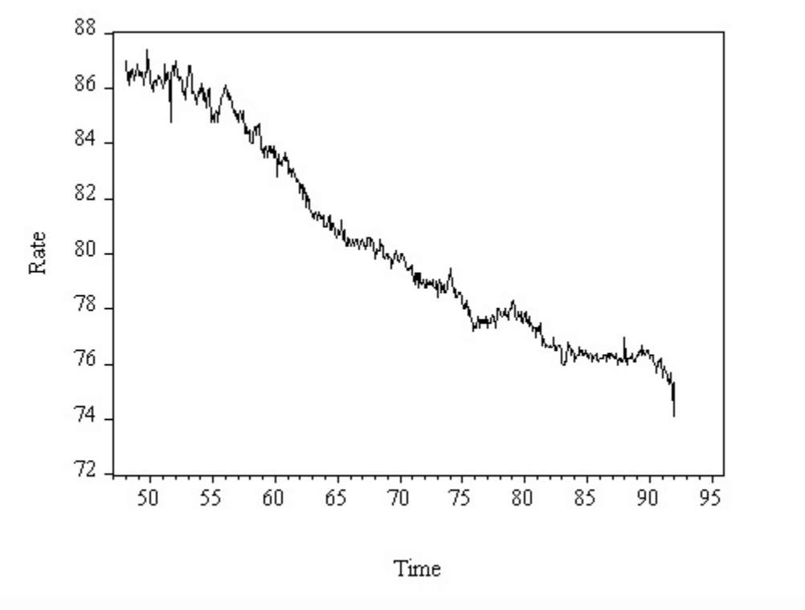
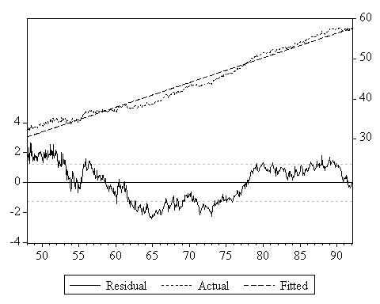
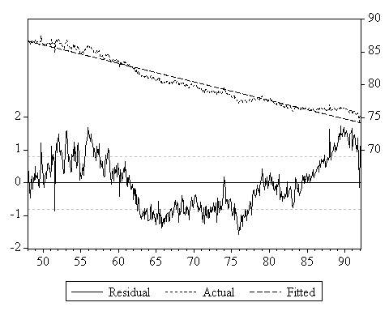
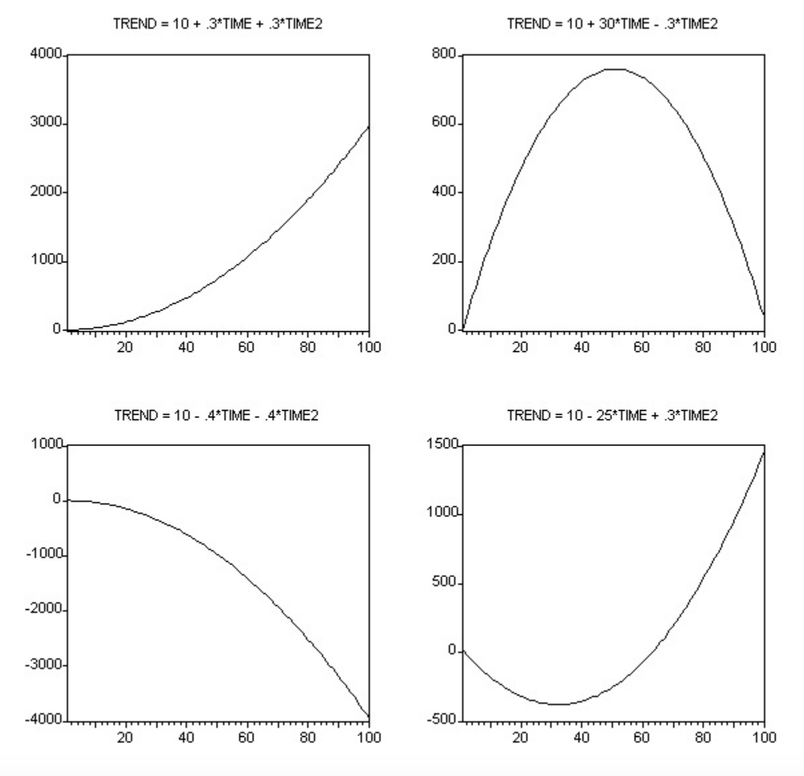
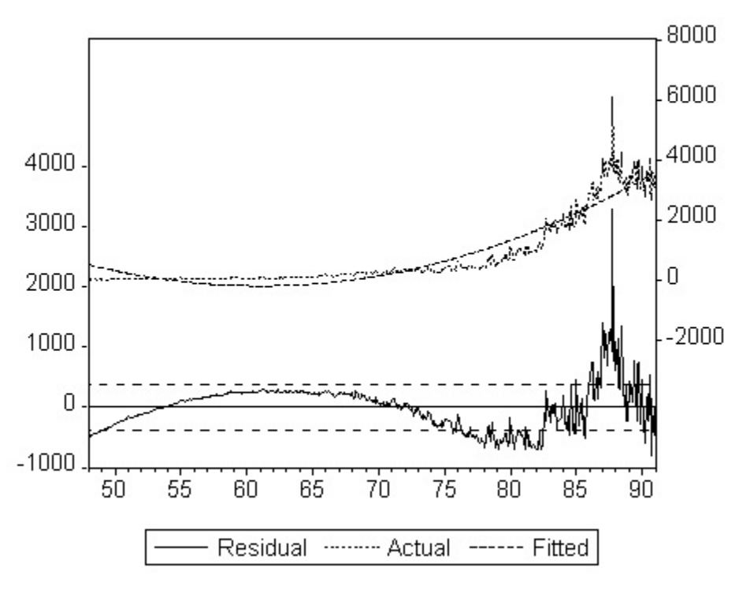
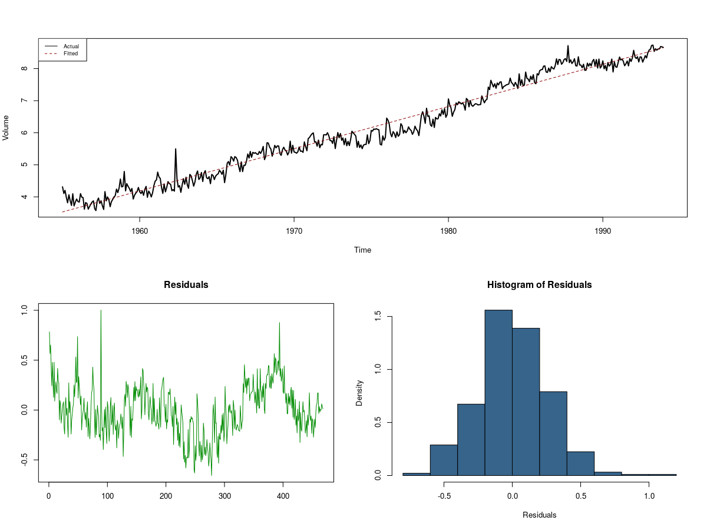

```{r setup, include=FALSE}
options(htmltools.dir.version = FALSE)
```

# **Агуулга**

- **Трендийг загварчлах**

- **Трендийн загваруудыг үнэлэх**

- **Трендийг таамаглах**

- **Таамаглал хийх загваруудыг сонгох шалгуурууд**

- **Хэрэглээ: Жижиглэн худалдааны борлуулалтыг таамаглах**

---

# Трендийг загварчлах

 - **Тренд**: хугацаан цуваан дахь удаан, урт хугацааны өөрчлөлт
 
 - **Детерминистик тренд**: Урьдчилан мэдэгдэх тренд (`time trend`)

--

.pull-left[

 
 - *Өсөх Тренд: Эмэгтэйчүүдийн хөдөлмөрийн зах зээлийн оролцоо*

]

--
.pull-right[


 - *Буурах Тренд: Эрэгтэйчүүдийн хөдөлмөрийн зах зээлийн оролцоо*

]
 
---
# Трендийг загварчлах

 - **Хугацаан цуваа**: $\{y_1, ...,y_T\}$

 - **Хугацааны индекс**: $(1, ...,T)$

Хугацаан цувааны индекс нь трендийг тайлбарлах гол хувьсагч: $\text{TIME}_t=t$

$$\text{TIME}=\begin{bmatrix}1 \\ 2 \\ \vdots \\ T\end{bmatrix}$$

## Тренд

 - Трендийг зөвхөн `TIME`-с хамааруулан загварчилдаг. 
 - **Шугаман трендийн загвар**
 
 $$\text{Trend}_t=\beta_0+\beta_1\text{TIME}_t$$
---
# Шугаман трендийн загвар
 
 $$\text{Trend}_t=\beta_0+\beta_1\text{TIME}_t$$

```{r, echo=FALSE, fig.fullwidth=TRUE, fig.align='center', fig.width = 9,fig.height=5.59,fig.cap="Өсөх, буурах шугаман тренд"}
plot(x = NULL, y = NULL,
     xlim = c(0, 100),
     ylim = c(-60, 40), xlab = "Time", ylab="Trend")
abline(a = 10,b = -0.25)
abline(a = -50, b = 0.8,lty="dashed")
text(20,15,"Trend = 10 - 0.25*Time")
text(32,-42,"Trend =- 50 + .8*Time")
```
---
# Шугаман трендийн загвар

.pull-left[

 
 - *Өсөх Тренд: Эмэгтэйчүүдийн хөдөлмөрийн зах зээлийн оролцоо*

]
.pull-right[


 - *Буурах Тренд: Эрэгтэйчүүдийн хөдөлмөрийн зах зээлийн оролцоо*
]

---
# Шугаман бус трендийн загвар
.center[
]
 Зарим тохиолдолд хугацаан цуваа илт шугаман бус трендтэй байдаг.
 
---
# Шугаман бус тренд загвар

 - **Квадрат Тренд**

$$\text{Trend}_t=\beta_0+\beta_1\text{TIME}_t+\beta_2\text{TIME}_t^2$$
 - **Экспоненциал Тренд**$$\text{Trend}_t=\beta_0\exp(\beta_1\text{TIME}_t)$$
   - log linear trend: $$\log(\text{Trend}_t)=\log(\beta_0)+\beta_1\text{TIME}_t$$

---
# Шугаман бус тренд хэлбэрүүд
.pull-left[

 - *Квадрат трендийн хэлбэрүүд*
 ]
.pull-right[

 - *Экспоненциал трендийн хэлбэрүүд*
 ]
 
---
# Шугаман бус тренд загварын таарамж

.pull-left[

 
 - *Квадрат трендийн таарамж*
]


.pull-right[

 - *Экспоненциал трендийн таарамж*
]

---
# Шугаман бус тренд загварын таарамж

.center[
]

